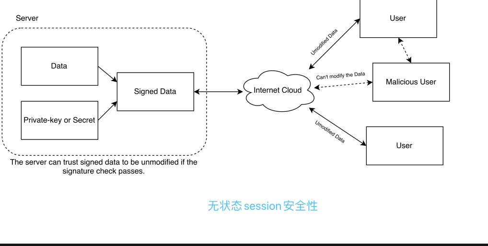
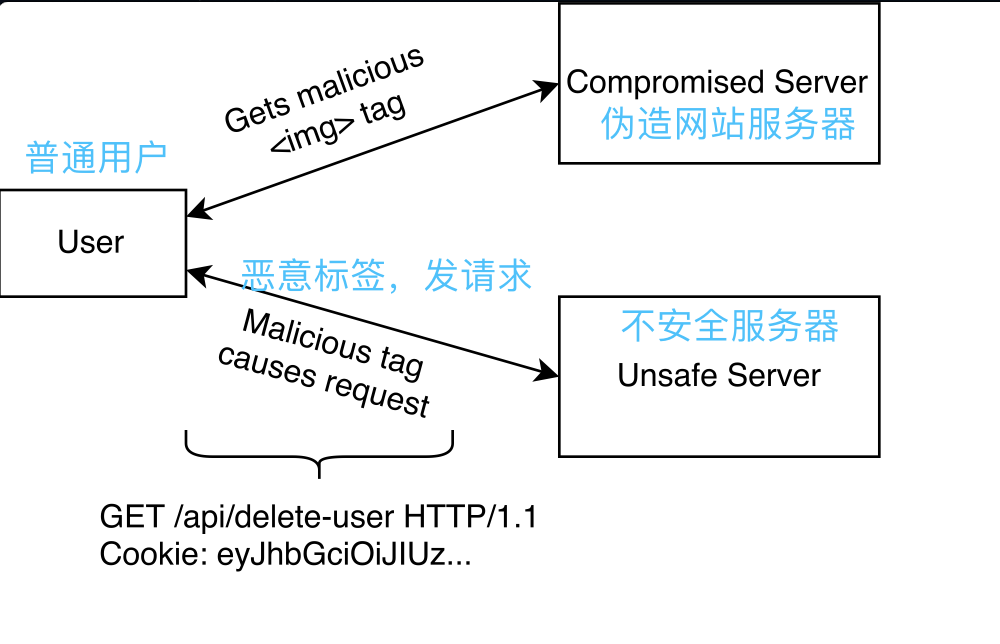

# 一.什么是jwt token
jwt是`JSON Web Token`的缩写，这是一种无状态的用户识别和数据加密方式。在web项目中应用非常广泛，可以说是目前最流行的跨域身份验证方案。

# 二.jwt token能做什么
- 1.用户认证（Authentication）
- 2.用户授权（Authorization）
- 3.联合认证（Federated identity）
- 4.客户端无状态session（Client-side sessions）
- 5.客户端加密（Client-side secrets）

# 三.什么是客户端无状态session
### 3.1 session是什么，为什么使用session
大部分web项目使用http协议实现客户端与服务端的交互，http是一种用完即销毁的一次性链接。客户端每次请求都要重新建立新的http链接，服务端接收到请求进行处理，再返回给客户端，最后关闭http链接。因此，我们说http是一种`无状态协议`。

既然http无状态，就无法携带上一次请求的信息。为了处理这个问题，Session出现了。

浏览器将这个SessionId保存在内存中，我们称之为无过期时间的Cookie。浏览器关闭后，这个Cookie就会被清掉，它不会存在于用户的Cookie临时文件。

以后浏览器每次请求都会额外加上这个参数值，服务器会根据这个SessionId，就能取得客户端的数据信息。

如果客户端浏览器意外关闭，服务器保存的Session数据不是立即释放，此时数据还会存在，只要我们知道那个SessionId,就可以继续通过请求获得此Session的信息，因为此时后台的Session还存在，当然我们可以设置一个Session超时时间，一旦超过规定时间没有客户端请求时，服务器就会清除对应SessionId的Session信息。

# 3.2.什么是无状态session
其实就是客户端数据。但是这种客户端数据是安全权的，用户无法篡改，因为它使用了签名和加密方式

# 四.常见网站恶意攻击的方式
对jwt攻击常见的常见方式就是移除签名，一个签名的jwt由三部分构成：头部（header）、负载（payload）和签名。有些jwt的验证库会将未签名的token视为有效，这种情况下容易被恶意用户截取并获取到复杂数据（payload）。

### 4.1 跨域站点请求伪造（CSRF）
跨域站点请求伪造（Cross-site Request Forgery）,一般会采用``标签的`src`属性向目标网站发起恶意代码，然后获取用户的cookie信息进行篡改，等用户再次访问正常网站时，将修改后的cookie信息发送给正常服务器。

### 4.2 XSS攻击
XSS（Cross-Site Script）是一种向授信网站注入跨域js脚本的攻击方式。如果不设置token的过期时间，恶意用户就能访问一些受保护的资源。常见的css攻击就是sql注入。

### 4.3jwt联合认证
联合认证系统允许不同的设置无关的服务通过中央认证和授权系统来识别用户，有两种常见的解决方案：SAML和OpenId Connect。如果这两种方式你都不想用，可以考虑使用jwt，流程如下：
- 1.用户尝试访问服务器资源
- 2.服务器发现用户没有访问凭证，重定向到授权服务器，授权服务器已经提前配置了凭证方提供的登录页，展示登录页
- 3.用户看到登录页，输入账号密码登陆
- 4.用户登陆成功，重定向到授权服务，授权服务使用凭证方提供的凭证访问服务器资源。
- 5.授权服务器重定向到资源服务器，现在万事大吉，资源服务器有了正确访问凭证。
- 6.用户成功访问资源。

上述流程出现了很多重定向，重定向会将数据嵌入到url中，因此这些过程的数据安全变得极其重要。下面jwt登场了，将所有数据使用jwt编码，这样授权服务器就可以给用户提供统一的接口和数据了。

# 五.jwt内部字段详解
前面说了，jwt包含三部分，分别是header（头部）、payload（负载）、signature（签名）。header和payload都是json格式，签名使用的加密算法，后面会详细讲签名。

### 5.1 header
主要包含以下字段
- 1.alg：jwt的签名和加密算法，如果不加密，就要设置`none`
- 2.typ：媒体类型（该字段很少出现，一般都设置为`JWT`）
- 3.cty：自定义字段的类型（很少出现）

### 5.2 payload
payload字段声明分为私有声明（private claim）和公有声明（public claim），私有声明是jwt内置字段，公有声明可以理解为用户自定义的字段。

私有声明包含的已注册声明（内置）如下：
- 1.iss: 发行人（issuer）,区分大小写的字符串或URI
- 2.sub: 主题（subject），区分大小写的字符串或URI
- 3.aud: 阅读者（audience），区分大小写的字符串或URI。如果声明该字段，读取方必须是`aud`指定的。当然读取的时候也可以忽略这个字段
- 4.exp: 过期时间（expiration）。数值类型，单位为秒。表示jwt还剩多少秒过期（大部分应用都允许几分钟的时间偏差）
- 5.nbf: 多少秒之后才有效（before time）。数值类型，单位为秒。例如`nbf=300`,表示5分钟后jwt才生效
- 6.iat:发布时间（issued time）。数值类型，单位为秒。
- 7.jti: JWT ID （唯一id）

### 5.3 不安全的jwt

